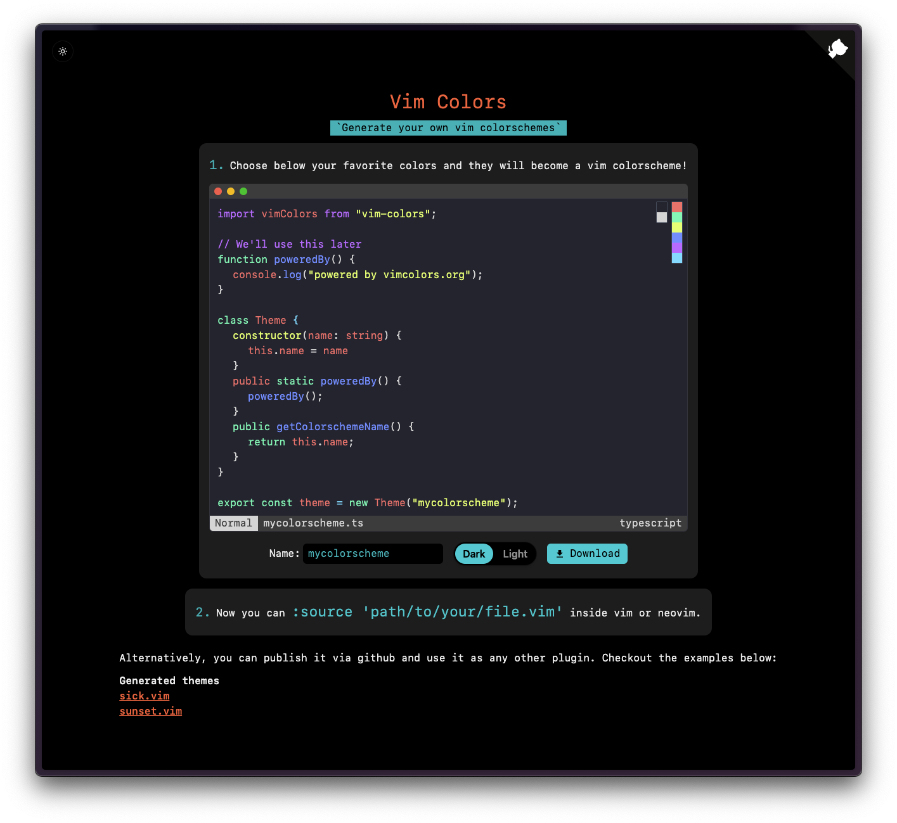
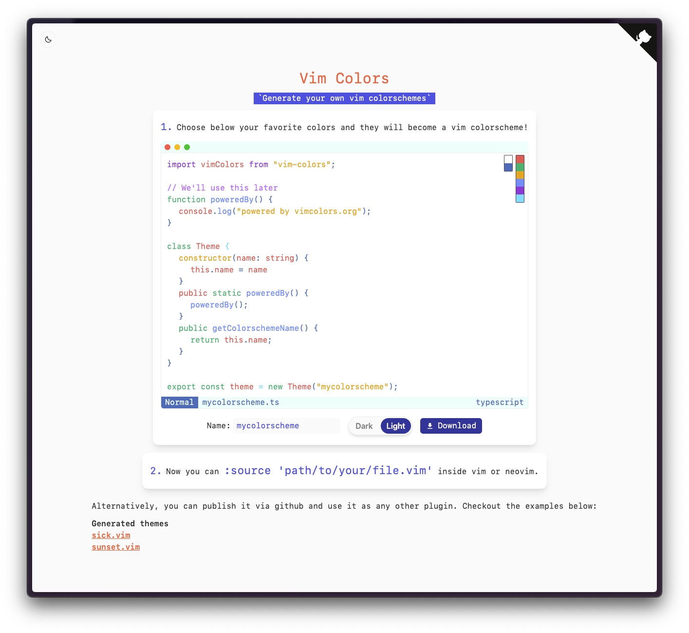

# [vimcolors.org](https://vimcolors.org)

> Customize your vim colors. Simple AF.

### Example schemes

These schemes were generated with this tool.

- [sick.vim](https://github.com/pablopunk/sick.vim)
- [sunset.vim](https://github.com/pablopunk/sunset.vim)
- Add yours here!

### See also

- [vim-colors](https://github.com/pablopunk/vim-colors): The npm module that this website uses
